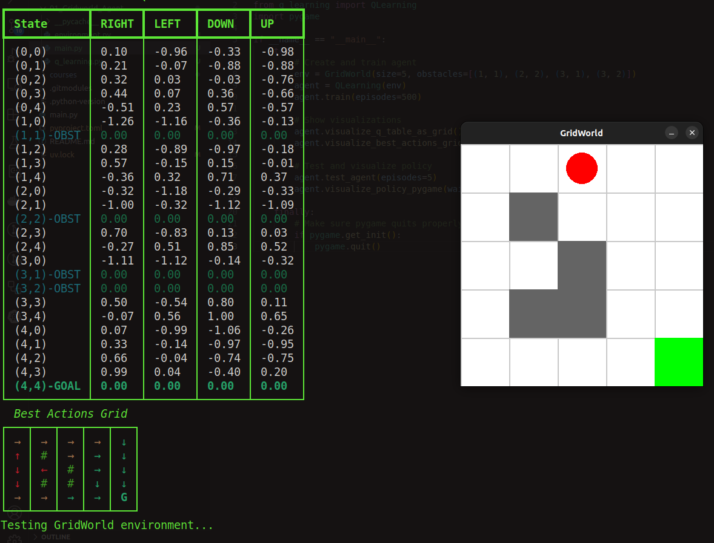

# Q-Learning GridWorld

This project implements a simple GridWorld environment and a Q-Learning agent to find optimal paths through a grid with obstacles.



## Overview

The GridWorld environment consists of a grid where an agent (red circle) must navigate from the starting position (top-left) to the goal (green square) while avoiding obstacles (gray cells). The agent learns through a Q-Learning algorithm, which builds a Q-table to represent the expected future rewards for each state-action pair.

## Files

- `environment.py` - Defines the GridWorld environment
- `q_learning.py` - Implements the Q-Learning algorithm
- `main.py` - Runs the training and visualization

## Environment

The GridWorld environment features:
- Customizable grid size
- Configurable obstacles
- Deterministic transitions
- Reward structure:
  - +1.0 for reaching the goal
  - -0.1 for each step (encourages finding the shortest path)
  - -1.0 for trying to move into a wall or obstacle

## Q-Learning Algorithm

The Q-Learning implementation includes:
- Epsilon-greedy exploration strategy
- Configurable learning rate, discount factor, and exploration parameters
- Automated decay of exploration rate during training
- Visualization of the learned Q-table and policy

## Usage

```python
# Create the environment
env = GridWorld(size=5, obstacles=[(1, 1), (2, 2), (3, 1), (3, 2)])

# Create and train the Q-Learning agent
agent = QLearning(env)
agent.train(episodes=500)

# Visualize the learned Q-table and policy
agent.visualize_q_table_as_grid()
agent.visualize_best_actions_grid()
agent.visualize_policy_pygame()

# Test the trained agent
agent.test_agent(episodes=5)
```

## Visualization Options

1. **Terminal-based Q-table visualization**:
   - Shows the Q-values for all state-action pairs
   - Color-coded for obstacles and the goal
   
2. **Terminal-based Best Actions grid**:
   - Shows the best action for each state with directional arrows
   - Provides a quick overview of the learned policy
   
3. **Pygame-based policy visualization**:
   - Interactive visualization of the environment
   - Shows the best action at each state with colored arrows
   - Displays Q-values

## Parameters

You can customize the learning process by adjusting:
- `alpha` (learning rate): Controls how much new information replaces old (default: 0.1)
- `gamma` (discount factor): Determines the importance of future rewards (default: 0.95)
- `epsilon`: Controls exploration vs. exploitation (default: 0.995)
- `epsilon_decay`: Rate at which exploration decreases (default: 0.99)
- `min_epsilon`: Minimum exploration rate (default: 0.1)

## Requirements

- Python 3.x
- NumPy
- Pygame

## Installation and Running

### Using uv (Recommended)

The project is set up to work with [uv](https://github.com/astral-sh/uv), a fast Python package installer and resolver.

```bash
# Run directly with uv
uv run 01_Gridworld_Agent/main.py
```

### Using pip

```bash
# Install dependencies from requirements.txt
pip install -r 01_Gridworld_Agent/requirements.txt

# Or install dependencies manually
pip install numpy pygame

# Run the project
python 01_Gridworld_Agent/main.py
```

### Using conda

```bash
# Create a conda environment
conda create -n gridworld python=3.10
conda activate gridworld

# Install dependencies
conda install numpy
pip install pygame  # Pygame is often installed via pip even in conda environments

# Run the project
python 01_Gridworld_Agent/main.py
```

### Installing as a Package

The main project includes a pyproject.toml file that allows you to install the entire project as a package. This is useful if you want to import modules from this project in other code.

```bash
# Install the package in development mode
pip install -e .

# Or with uv
uv pip install -e .
```

## Next Steps

Possible extensions to this project:
1. Implement stochastic transitions
2. Add variable rewards or multiple goals
3. Implement other reinforcement learning algorithms (SARSA, Expected SARSA)
4. Scale to larger environments
5. Add visualization of the learning progress over time